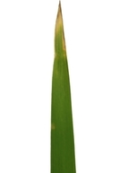
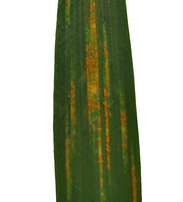
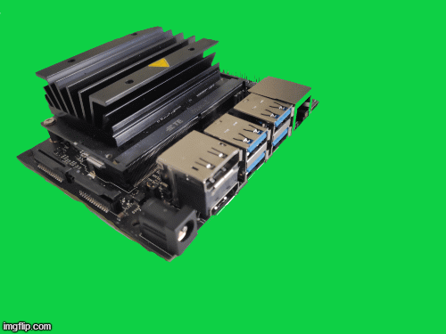
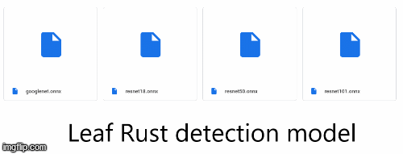

# Biotic and Abiotic stress on which study was carried out
Plant suffers from different biotic and abiotic stress. Nitrogen is primary nutrient in agriculture and its deficiency needs to be dtected. Also leaf rust is a major pathogen of wheat which diminishes the photosynthesis abiliuty of wheat and thus affects yields.

|  | 
|:--:| 
| *(a)Nitrogen deficit stress in wheat* |

|  | 
|:--:| 
| *(b)Leaf Rust diseases in wheat* |


<br><br>
# Edge_computing device used
- Jetson nano
- 128-core NVIDIA Maxwell™ GPU

  

<br><br>
# Model Links
Open Neural Network Exchange (ONXX moldels)
ONNX is an open format built to represent machine learning models. ONNX defines a common set of operators - the building blocks of machine learning and deep learning models - and a common file format to enable AI developers to use models with a variety of frameworks, tools, runtimes, and compilers.



### For N stress detection
ResNet model varinats for nitrogen deficiency identification
[link](https://drive.google.com/drive/folders/1pVvE13rbemEhJkpmHpb0Y5s4UAAWjaDd?usp=sharing).


### For Leaf Rust (*Puccinia triticina*)
ResNet model varinats for leaf rust identification
[link](https://drive.google.com/drive/folders/16cp_STmyDPZApVKWuAFTSKa9bHb8TVj7?usp=sharing )  

<br><br>
# Directions for using the model for inteference on Jetson Nano
### Using the model for inference on files in storage
The workflow proposed and models trained can also be used for live camera inference. It can be achived with following bash command on the jetson termiunal
```bash
cd jetson-inference/python/training/classification
DATASET=~/datasets/healthy_diseased
imagenet-console.py --model=resnet50/resnet50.onnx --input_blob=input_0 --output_blob=output_0 --labels=$DATASET/labels.txt $DATASET/test/12_diseased.jpg
```
### Using the model for device live camera inference
The workflow proposed and models trained can also be used for live camera inference when a camera module is connected. It can be achived with following bash command on the jetson terminal.
```bash
cd jetson-inference/python/training/classification
DATASET=~/datasets/
imagenet.py --model=models/resnet18.onnx --input_blob=input_0 --output_blob=output_0 --labels=$DATASET/labels.txt csi://0
```
 Note: jetson-inference needs to be installed 
