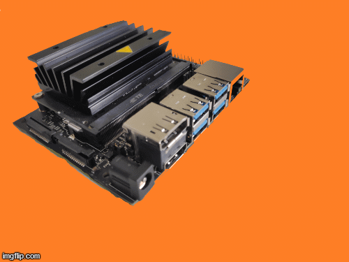

# Edge_computing device used
- Jetson nano
- 128-core NVIDIA Maxwell™ GPU




# Model Links
Open Neural Network Exchange (ONXX moldels)
ONNX is an open format built to represent machine learning models. ONNX defines a common set of operators - the building blocks of machine learning and deep learning models - and a common file format to enable AI developers to use models with a variety of frameworks, tools, runtimes, and compilers.

## For N stress detection
Different models for nitrogen deficiency identification
[link](https://drive.google.com/drive/folders/1pVvE13rbemEhJkpmHpb0Y5s4UAAWjaDd?usp=sharing).


## For Leaf Rust (*Puccinia triticina*)
Different models for leaf rust identification
[link](https://drive.google.com/drive/folders/16cp_STmyDPZApVKWuAFTSKa9bHb8TVj7?usp=sharing )


# Using the model on the device
The workflow proposed and models trained can also be used for live camera inference. It can be achived with following bash command on the jetson termiunal
```bash
cd jetson-inference/python/training/classification
DATASET=~/datasets/healthy_diseased
imagenet-console.py --model=resnet50/resnet50.onnx --input_blob=input_0 --output_blob=output_0 --labels=$DATASET/labels.txt $DATASET/test/12_diseased.jpg
```
# Using the model for device live camera inference
The workflow proposed and models trained can also be used for live camera inference when a camera module is connected. It can be achived with following bash command on the jetson terminal.
```bash
cd jetson-inference/python/training/classification
DATASET=~/datasets/diseases
imagenet.py --model=models/resnet18.onnx --input_blob=input_0 --output_blob=output_0 --labels=$DATASET/labels.txt csi://0
```


 *Note:  you can aso import onxx model in your pc as it is general format for saving model across devices. *
 
